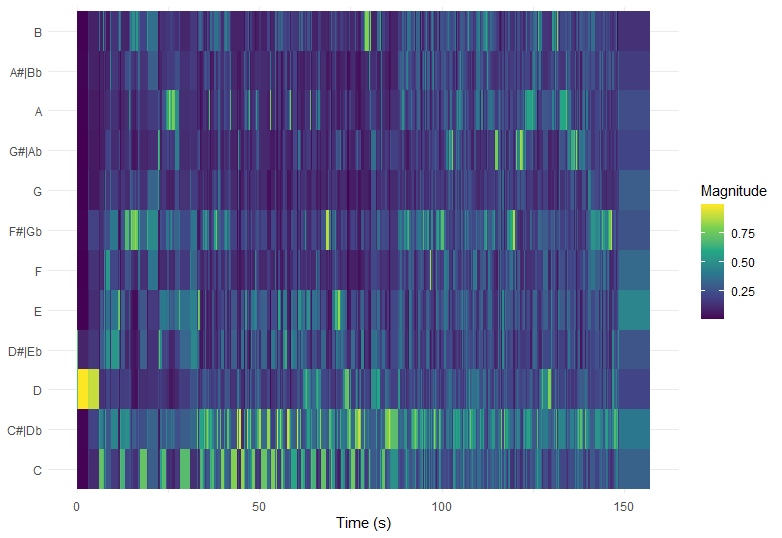

```{r setup, include=FALSE}
library(flexdashboard)
```

Column {data-width=150}
-----------------------------------------------------------------------

### The First Exploration into Soundtracks {data-commentary-width=400}

```{r}

```

For this project I have dug deep into the characteristics of soundtracks. Virtually any piece of music which is used or specifically written for a movie, tv series, documentary or game can be classified as a soundtrack. It is a typical subgenre which mostly has a niche fanbase and the music is generally of a longer length. And it is mostly served as an addition to media, but many people listen to this music standalone and visit concerts in which such soundtracks are performed. I chose it because I am personally a big fan of soundtracks and I am also creating soundtracks myself. I was eager to find out if there are any surprises to  be found among this specifc music genre, as well as in comparison between several composers and between pieces which have a different purpose.

Column {data-width=350}
-----------------------------------------------------------------------


```{r}

```


### A Global Analysis of Famous Soundtracks {data-commentary-width=400}

```{r}
```


***

Here you can see a scatterplot from the playlist ''Iconic Soundtracks'', which also consists soundtracks of various other composers and here I compared instrumentalness and energy. Here it is clearly shown again that most tracks score high on instrumentalness and have quite low energy levels. Again, certain outliers on both levels still exist. What I think is interesting from these analyses is that it shows that even two composers show quite some variety in the characteristics of their tracks, but that roughly speaking there are also similarities. I am interested to further investigate comparisons from other big composers and from main famous soundtracks in general, to find out more interesting differences and similarities. And I am also interested to further analyse specific outliers, to find out what is so different about them.


### Comparing Hans Zimmer & John Williams


***

These two graphs show the main differences of the music by Hans Zimmer and John Williams. First, you see an analysis of characteristic track features of famous tracks created by them. For both of them I used the ''This is'' playlist from Spotify. I made a visualization which shows if a song is major or minor, and showed the instrumentalness and valence levels for their tracks. The size of the circles show the energy level of the tracks. What you can clearly see already is that from both composers, most songs show high instrumentalness and low valence and this is most evident for Hans Zimmer. And he also has some tracks which score low in instrumentalness and low on valence, which I called ''sombre vocalization''. But he also has some outliers which are high on valence, on a level that the outliers of John Williams don't reach. This is what I called ''happy instrumentation''. It is also clear that the majority is written in minor and that a large level of songs has an average energy level.

### The Outlier Kawai - Utai IV: Reawakening



*** 

I thought it was interesting to create a chromogram of one specific outlier to see if something extraordinary can be found about this soundtrack. This is the track Kenji Kawai- Utai IV: Reawakening. It is represented by the the dot all the way in the upper left of the scatter plot, which has the lowest instrumentalness and the highest energy. What can be seen is that the highest magnitude can be found in the C and C#/Db notes throughout the song. But there are two main moments in which the notes are clearly rising, and three main moments where they are descending. You can hear it in the song when a strong emphasis is put on a choir of which the vocals are rising. And somewhere in the middle the highest point is reached, on a B note. 

### Concluding the Project

```{r}

```

