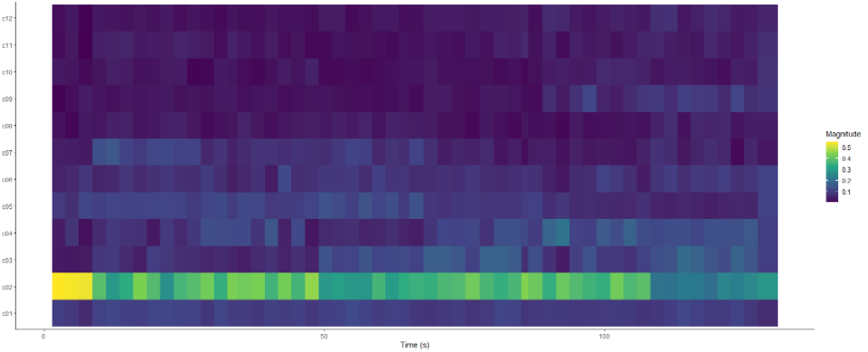
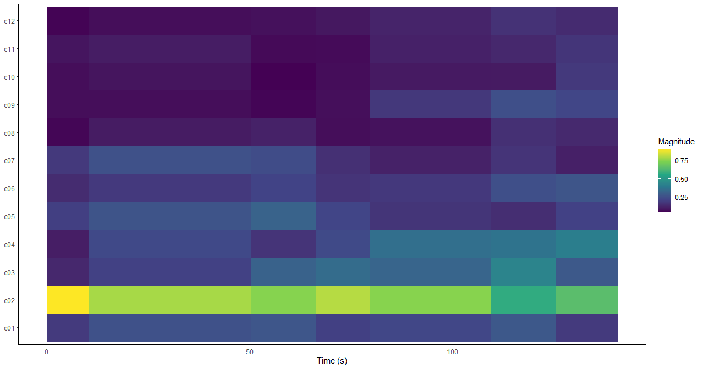

```{r setup, include=FALSE}
library(flexdashboard)
```

Column {data-width=150}
-----------------------------------------------------------------------

### The Keys in the music from Hans Zimmer and John Williams


*** 

In this histogram you can see the keys that are used in the soundtracks by Hans Zimmer and John Williams. It is clear that the most used keys by Hans Zimmer are D and G and by John Williams C is most often used. What you can also see from this histogram is that Hans Zimmer uses a wide variety of keys in his soundtracks, having at least used every key once. John Williams didn't use every key and his use of keys is more concentrated. 


### Two Chordograms "Hans Zimmer - I'm not a Hero" & "John Williams - Duel of the Fates"


***
Here I dive deeper on two famous works from Hans Zimmer and John Williams, to see if some differences can be found using a chordogram for both tracks. Firstly, an analysis the track I'm not a Hero, the soundtrack for the movie Batman: The Dark Knight. What is clear already from a first glance, is that Hans Zimmer uses a concentration of a couple of the same chords throughout the entire track, but that there is still a variety of other chords on top of that to keep the track dynamic and unique. From the chordogram of Duel of the Fates (the soundtrack for Star Wars: The Phantom Menace), it can be seen that John Williams uses a much wider array of chords throughout the entire track. When you listen to this track it also makes sense, it is a more bombastic track, consisting of a  powerful choir and a large amount of instruments. As two tracks are not enough to draw large conclusions from this comparison, it can still be said that in this case Hans Zimmer uses a more subtle and minimalistic approach regarding chords and that John Williams uses a larger melodic and harmonic soundscape at once. Hereafter, you can see a larger analysis of multiple tracks to build further on this comparison to see if this is the case for more tracks, using other ways of analysis as well. 

### Central point in scatterplot: Yann Tiersen - Comptine d`un autre ete-l'apres-midi {data-commentary-width=400}




***

As interesting it is to analyze outliers, it is also relevant to analyze a central point in the corpus, a soundtrack which can be classified as averege. I decide to choose a point on the intrumentalness/energy scatterplot, with instrumentalness around 0.90 and energy around 0.2. A song which fit this well is Yann Tiersen - Comptine d`un autre ete-l'apres-midi, the famous piano soundtrack of the French movie Le Fabuleux Destin d'Amélie Poulain. For this I created two cepstrograms, the first one based on bars and the second on sections. At the first cepstrogram you can clearly see that there is a steady basis in the song which flows during the entire song, with a very high magnitude at the start and maintaining this magnitude throughout the entire song, only losing some strength at the end. Furthermore, it shows some extra activity throughout the song in some sections indicated by the light blue colors. At the second cepstrogram it can be seen that there are seven main sections, of which the first has the strongest magnitude at the root note. After the start of the song, more energy starts to appear in the higher sections. Then there is a moment of calmness when the color turns darker green, followed by a short section of lighter green, and darker green again. This is a good representation of a soundtrack, which is usually divided in several sections which are not evenly divided like in pop songs.


### Self Similarity Matrices: Hans Zimmer I'm not a hero


***
Here you can see two self similarity matrices for the soundtrack I'm not a hero created by Hans Zimmer. I chose this one for this analysis, because it is a very famous soundtrack, and personally one of my favourites. I was curious to find out if the originality in the music is somehow reflected in these matrices.

In the first one, regarding timbre, it can be seen that the beginning is much like the rest of the song and that later on, there are new elements introduced. and moments of uniqueness and similarity are alternated. This makes sense, it starts with a slow buildup with many elements that are there throughout the song and which are later accompanied with more instruments to make it more cinematic and powerful. Throughout the song, slower moments are alternated by more powerful moments. The bright yellow line indicates a loud crash accompanied by brass sounds rising in intensity. This is a unique moment in the song.

In the second matrix regarding chroma (pitches), a different pattern can be seen. It is indicated that around the first half of the song, many unique pitches are heard and through the second half, mostly pitches that are common in the song are heard. This can be explained by the fact that the beginning of the track consists of several high pitched percussion instruments which are not heard much more in the song. The majority of this song consists of either very quiet or bombastic moments and these moments occur mostly during the second half of the song. 


### The First Exploration into Soundtracks {data-commentary-width=400}

```{r}

```

For this project I have dug deep into the characteristics of soundtracks. Virtually any piece of music which is used or specifically written for a movie, tv series, documentary or game can be classified as a soundtrack. It is a typical subgenre which mostly has a niche fanbase and the music is generally of a longer length. And it is mostly served as an addition to media, but many people listen to this music standalone and visit concerts in which such soundtracks are performed. I chose it because I am personally a big fan of soundtracks and I am also creating soundtracks myself. I was eager to find out if there are any surprises to  be found among this specifc music genre, as well as in comparison between several composers and between pieces which have a different purpose.

Column {data-width=350}
-----------------------------------------------------------------------


```{r}

```


### A Global Analysis of Famous Soundtracks {data-commentary-width=400}

```{r}
```


***

Here you can see a scatterplot from the playlist ''Iconic Soundtracks'', which also consists soundtracks of various other composers and here I compared instrumentalness and energy. Here it is clearly shown again that most tracks score high on instrumentalness and have quite low energy levels. Again, certain outliers on both levels still exist. What I think is interesting from these analyses is that it shows that even two composers show quite some variety in the characteristics of their tracks, but that roughly speaking there are also similarities. I am interested to further investigate comparisons from other big composers and from main famous soundtracks in general, to find out more interesting differences and similarities. And I am also interested to further analyse specific outliers, to find out what is so different about them.


### Comparing Hans Zimmer & John Williams


***

These two graphs show the main differences of the music by Hans Zimmer and John Williams. First, you see an analysis of characteristic track features of famous tracks created by them. For both of them I used the ''This is'' playlist from Spotify. I made a visualization which shows if a song is major or minor, and showed the instrumentalness and valence levels for their tracks. The size of the circles show the energy level of the tracks. What you can clearly see already is that from both composers, most songs show high instrumentalness and low valence and this is most evident for Hans Zimmer. And he also has some tracks which score low in instrumentalness and low on valence, which I called ''sombre vocalization''. But he also has some outliers which are high on valence, on a level that the outliers of John Williams don't reach. This is what I called ''happy instrumentation''. It is also clear that the majority is written in minor and that a large level of songs has an average energy level.

### The Outlier Kawai - Utai IV: Reawakening


*** 

I thought it was interesting to create a chromogram of one specific outlier to see if something extraordinary can be found about this soundtrack. This is the track Kenji Kawai- Utai IV: Reawakening. It is represented by the the dot all the way in the upper left of the scatter plot, which has the lowest instrumentalness and the highest energy. First it is noticeable that there is a strong emphasis on the D note in the beginning of the track. Furthermore, the highest magnitude can be found in the C and C#/Db notes throughout the song. And there are two main moments in which the notes are clearly rising, and three main moments where they are descending. You can hear it in the song when a strong emphasis is put on a choir of which the vocals are rising. And somewhere in the middle the highest point is reached, on a B note. What could make this different from other soundtracks is the strong emphasis on vocalization. But the fact that it builds up clearly and has a steady ongoing flow of the same notes is not so uncommon in soundtracks. To find out more about this, I have made different chromograms of soundtracks, as you can see in the other parts in this portfolio.

### Concluding the Project 

```{r}

```

