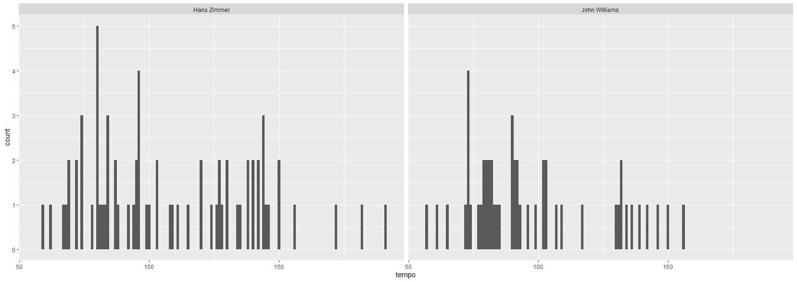

```{r setup, include=FALSE}
library(flexdashboard)
```

----------------------------------------------------------------------


### Introduction to the Exploration into Movie Soundtracks {data-commentary-width=400}

```{r}

```

For this project I have dug deep into the characteristics of movie soundtracks. Virtually any piece of music which is used or specifically written for a movie, tv series, documentary or game can be classified as a soundtrack. It is a subgenre which mostly has a niche fanbase and the music is generally of a longer length. It is mostly served as an addition to media, but many people listen to this music standalone. Especially movie soundtracks are becoming a larger part of the mainstream, and large concerts where movie soundtracks are performed are getting more and more common. I chose this subject because I am personally a big fan of soundtracks and I am also creating soundtracks myself. I specialized on only movie soundtracks for this research, since this is the type of soundtrack I listen to the most and was also the most convenient to find large playlists from, consisting of commonly known works by famous composers which are know by the general audience. And precisely because soundtracks have started to become more and more part of the mainstream, I was interested to find out if I could find any common elements in the music, just as you could find in other popularized music like pop music. 

The purpose of this research was to find out if there are any ways to characterize a movie soundtrack, as well as to find out if there are any big differences among them. I chose to analyze famous movie soundtracks of many different movie, because they were made for many different genres by many different compers and I thought it was interesting to find out if there would still be any ways to characterize them as a group.
Secondly I researched the similarities and differences between the soundtracks made by the famous composers Hans Zimmer and John Williams. I chose these two composers because they are well known among the broader audience and have created many soundtracks for different movies.

For this project I have used four different playlists:

-''Iconic Soundtracks'', which is a playlist by Spotify with a collection of 65 characteristicmovie soundtracks which are famous with a broader audience. 

https://open.spotify.com/playlist/37i9dQZF1DX1tz6EDao8it?si=4c1c11a2f0a8401b

-''This is Hans Zimmer'', which contains 70 works from this famous soundtrack composer

https://open.spotify.com/playlist/37i9dQZF1DWWF3yivn1m3D?si=84936a35a0984cb6

-''This is John Williams'', which contains 50 works from this famous soundtrack composer

https://open.spotify.com/playlist/37i9dQZF1DZ06evO1RMsso?si=eb82ee8aa5cb40b4

-The last playlist consists of the 20 longest tracks from the Iconic Soundtracks playlist, to be used to create a heatmap from. Technically it was not possible for my PC to handle the entire playlist for this purpose.

https://open.spotify.com/playlist/4eINd9fSDbMODjgPz6iNtX?si=0dd83669dec143cf


Column {data-width=350}
-----------------------------------------------------------------------

### A Global Analysis of Famous Soundtracks {data-commentary-width=400}

```{r}
```


***

I started of the research by creating a scatterplot from the playlist ''Iconic Soundtracks''. where I compared instrumentalness and energy. I chose these features, because the most soundtracks I know all have a different amount of energy and are usually instrumental. I wanted to find out if this would also be the case for this playlist. And of all of the track level features, I think these are the most relevant for soundtracks, since the driving factors of soundtracks are the high dynamics in instrumentation.
Here it is clearly shown again that most tracks score high on instrumentalness and have quite low energy levels, but outliers on both levels still exist. What I think is interesting from these analyses is that my assumption that there are so many different types of energy levels in soundtracks still holds ground, but that lower energy levels are more common. Furthermore it confirms that instrumentalness is indeed very high on most tracks. This outcome made me more interested to further analyse a specific outlier as well as a central point, to find out what is so different about them. You will find an analysis of one outlier in the next tab, as well as from one track which is one of the central points in the scatterplot.

### Outlier & Central Point


*** 
**Outlier: Kenji Kawai- Utai IV: Reawakening**

On the first picture you can see a chromogram of one outlier which I created to find out if something extraordinary can be found about this soundtrack. This is the track Kenji Kawai- Utai IV: Reawakening. It is represented by the the dot all the way in the upper left of the scatter plot, which has the lowest instrumentalness and the highest energy. First it is noticeable that there is a strong emphasis on the D note in the beginning of the track. Furthermore, the highest magnitude can be found in the C and C#/Db notes throughout the song. And there are two main moments in which the notes are clearly rising, and three main moments where they are descending. You can hear it in the song when a strong emphasis is put on a choir of which the vocals are rising. And somewhere in the middle the highest point is reached on a B note. What could make this different from other soundtracks is the strong emphasis on vocalization. But the fact that it builds up clearly and has a steady ongoing flow of the same notes is not so uncommon in soundtracks. 


***

**Central Point: Yann Tiersen - Comptine d`un autre ete-l'apres-midi**

As interesting it is to analyze an outlier, it is also relevant to analyze a central point in the corpus, a soundtrack which can be classified as average. I decide to choose a point on the intrumentalness/energy scatter plot, with instrumentalness around 0.90 and energy around 0.2. A song which fit this well is Yann Tiersen - Comptine d`un autre ete-l'apres-midi, the famous piano soundtrack of the French movie Le Fabuleux Destin d'Amélie Poulain. For this I created two cepstrograms, which you can see in the second and third picture. The first one is based on bars and the second one on sections. At the first one you can clearly see that there is a steady basis in the song which flows during the entire song, with a very high magnitude at the start and maintaining this magnitude throughout the entire song, only losing some strength at the end. Furthermore, it shows some extra activity throughout the song in some sections indicated by the light blue colors. At the second cepstrogram it can be seen that there are seven main sections, of which the first has the strongest magnitude at the root note. After the start of the song, more energy starts to appear in the higher sections. Then there is a moment of calmness when the color turns darker green, followed by a short section of lighter green, and darker green again. This is a good representation of a soundtrack in general, which is usually divided in several sections which are not evenly divided like in pop songs. And when you listen to the song you hear that these these sections are indeed how the song is structured.


### Tempi Iconic Soundtracks


 
 


***

**Tempi of Iconic Soundtracks**

After the track-level features and structure of some soundtracks were researched, it was also relevant to research the role tempo plays in movie soundtracks. Using the playlist Iconic Soundtracks, I created a histogram in which you can see the tempi of the soundtracks. Here you can see that in general, the tempo lies between 60 and 150 bpm with some outliers. I wanted to see if the outliers' tempo was actually correct or a mistake and that perhaps the BPM was doubled or halved. I listened the songs and tapped with a BPM counter to find an answer to this.

***

**Tempogram Lowest BPM: The Godfather Waltz**

For the first 2 outliers on the lower end I realized it was halved so in fact the speed was around 100 bpm. I think the mistake was made because the instrumentation was quiet. For the third one (Nino Rota - The Godfather Waltz), the BPM of 62 was correct, therefore I created a cyclic tempogram for it to find out if there were any interesting features of this outlier. It is clear that this tempopgram doesn't show the real BPM, but a lot of activity is seen around 100 BPM, especially between 30 and and 70 seconds. If you assume that the BPM is doubled in the entire tempogram, it is correct. After this mark the song gets even more quiet with only a sad violin, it is clear that not much information is picked up here, the same as in the beginning of the song. But after around 110 seconds, a piano starts to sound with a faster pace, this makes clear why here there is a yellow vertical line, since the algorithm doesn't know what the exact tempo is anymore. 

***

**Tempogram Highest BPM: Hans Zimmer - Discombobulate**

It was also interesting to analyze an outlier on the other end. The four fastest ones, with the fastest almost at 200 bpm were clearly doubled and one even tripled. The real outlier is Hans Zimmer - Discombobulate, the fast paced soundtrack for the movie Sherlock Holmes. When you listen to it, it is easy to follow the speed, since the drums and other instruments clearly map out the empahiss of the beatlibrary(tidyverse). This is shown clearly in the cyclic tempogram, which correctly outlines the speed of 142 bpm. 

### Self Similarity Matrices: Hans Zimmer I'm not a hero


***
Here you can see two self similarity matrices for the soundtrack I'm not a hero created by Hans Zimmer. I chose this one for this analysis, because it is a very famous soundtrack, and personally one of my favorites. I was curious to find out there is some kind of structure to be found in the self similarity matrices which can explain why this soundtrack has so much strength.

In the first one, regarding timbre, it can be seen that the beginning is much like the rest of the song and that later on, there are new elements introduced. and moments of uniqueness and similarity are alternated. This makes sense, the song starts with a slow buildup with many elements that are there throughout the song and which are later accompanied with more instruments to make it more cinematic and powerful. As it progresses, slower moments are alternated by more powerful moments. The bright yellow line indicates a loud crash accompanied by brass sounds rising in intensity, which is musically a unique moment in the song.

In the second matrix regarding chroma (pitches), a different pattern can be seen. It is indicated that around the first half of the song, many unique pitches are heard and through the second half, mostly common pitches are played. This can be explained by the fact that the beginning of the track consists of several high pitched percussion instruments which are not heard later in the song. The majority of the track consists of either very quiet or bombastic moments and these moments occur mostly during the second half.

The main conclusion from this is that there is a big variety in the music and that loud and quiet moments alternate. This characterizes this song a I know it and this is why it works so well with the movie, in which it is being used as a theme for when the Batman appears and builds up great suspension for what is going to happen next.


### Clustering Key Features


*** 

As a last step to my research on the Iconic Soundtracks playlist I wanted to get a broader overview of the similarities between several tracks. Therefore, I created a heatmap with seven characteristics I thought would show the most interesting differences between tracks and groups of tracks: liveness, tempo, instrumentalness, loudness, energy, valence and acousticness. I used the 20 longest tracks from the playlist ''Iconic Soundtracks'', because the full playlist was too much to handle for my pc. Longer tracks have more variation in them, so I thought it would make the analysis even more interesting.

What is already apparent from a first glance is that there are two outliers on two different characteristics. The track ''With my own eyes'' scores very high on liveness and ''Flight to Neverland'' very high on valence. However this is all relative, the liveness score for the first track is just 0,21, and it has no audible audience, so in this sence the yellow colour can be a bit misleading. The same goes for the high valence in the second track, which is 0.35 which is not even near the highest possible valence score. But in this corpus they are the definitely outlier on these factors.

Another interesting analysis can be made by how the characteristics are grouped. Tempo and instrumentalness are grouped together, which implies that on general, tracks with low intrumentalness have also a lower tempo and vice versa. But not all classifications regarding instrumentalness are as accurate, since many soundtracks consist of some choir and sometimes the API picks it up but not always. This means drawing strong conclusions from this is not realiable. Loudness and energy are correlated in the same way according to this heatmap and it makes sense: louder soundtracks usually convey more energy, since they consist of more bombastic elements and energetic choirs. This becomes clear specially when you listen to the track ''Raider's March'' which has an energy score of 0.35. 

As you can see, there are many clusterings for the individual tracks. For example, the second and third row from below show the connection between ''Pure Spirits of the Forest'' and ''Blade Runner Blues'. You can see they are very similar on all of the characteristics. But when you listen to these tracks, they still show some differences. Pure Spirits of the Forests is a piece which builds up very slowly with calm and peaceful elements and has an energetic part at the end. Blade Runner Blues has the same calmness but has a way fuller sound throughout the entire track. But here the same problem as before occurs: the colors are not always accurate. The loudness is correct, and tempo shows the same color which makes sense, since they have a similar tempo. But liveness is not correct since they both have no sound of an audience in the recording.


### Comparing Hans Zimmer & John Williams: Introduction 


***

These two graphs show the main differences of the music by Hans Zimmer and John Williams. First, you see an analysis of characteristic track features of famous tracks created by them. For both of them I used the ''This is'' playlist from Spotify. I made a visualization which shows if a song is major or minor, and showed the instrumentalness and valence levels for their tracks. The size of the circles show the energy level of the tracks. What you can clearly see already is that from both composers, most songs show high instrumentalness and low valence and this is most evident for Hans Zimmer. And he also has some tracks which score low in instrumentalness and low on valence, which I called ''sombre vocalization''. But he also has some outliers which are high on valence, on a level that the outliers of John Williams don't reach. This is what I called ''happy instrumentation''. It is also clear that the majority is written in minor and that a large level of songs has an average energy level.

### Comparing Hans Zimmer & John Williams: Tempo & Keys

 


***

**Tempo**

In the first two pictures you can see a histogram in which the different tempi of the soundtracks by Hans Zimmer and John Williams are compared. It is clear that Hans Zimmer uses a larger variety of tempi compared to John Williams, and Hans Zimmer has more tracks with a higher tempo. This concentration in one aspect was also seen before in the analysis of keys, which showed that Hans Zimmer used a larger variety of keys and John Williams focused on a select group of keys to be used in his tracks. 

*** 

**Keys**

In the last two pictures you can see a histogram in which the keys that are used in the soundtracks by Hans Zimmer and John Williams are displayed. It is clear that the most used keys by Hans Zimmer are D and G and by John Williams C is most often used. What you can also see from this histogram is that Hans Zimmer uses a wide variety of keys in his soundtracks, having at least used every key once. John Williams didn't use every key and his use of keys is more concentrated. 


### Comparing Hans Zimmer & John Williams: Chordograms of ''Im not a Hero'' & ''Duel of the Fates


***

Here I dive deeper on two famous works from Hans Zimmer and John Williams, to see if some differences can be found using a chordogram for both tracks. Firstly, an analysis the track I'm not a Hero, the soundtrack for the movie Batman: The Dark Knight. What is clear already from a first glance, is that Hans Zimmer uses a concentration of a couple of the same chords throughout the entire track, but that there is still a variety of other chords on top of that to keep the track dynamic and unique. From the chordogram of Duel of the Fates (the soundtrack for Star Wars: The Phantom Menace), it can be seen that John Williams uses a much wider array of chords throughout the entire track. When you listen to this track it also makes sense, it is a more bombastic track, consisting of a  powerful choir and a large amount of instruments. As two tracks are not enough to draw large conclusions from this comparison, it can still be said that in this case Hans Zimmer uses a more subtle and minimalist approach regarding chords and that John Williams uses a larger melodic and harmonic soundscape at once. Hereafter, you can see a larger analysis of multiple tracks to build further on this comparison to see if this is the case for more tracks, using other ways of analysis as well. 


```{r}

```


### Concluding the Project 

**Conclusion on Iconic Soundtracks**

I already had a solid knowledge about iconic soundtracks, but researching this playlist gave me even more. It confirmed my knowledge that soundtrack structures are so different than other types of music. It doesn't have a clear cut structure and usually shows a variety of loudness and dynamics. But this can in fact be seen as a characteristic element of a soundtrack. This variety was clearly reflected in the cepstrogram of the central point in the corpus, as well as in the self similarity matrices. Even in the analyzed outlier I found that the variety was evident, which made it not so much of an outlier on the aspect that it differed so much from the other soundtracks.

**Conclusion on Hans Zimmer & John Williams**

When I started the research to compare them, I didn't think there was a huge difference between them. Still, I found some interesting differences. Hans Zimmer uses a wide variety of keys in his soundtracks, having at least used every key once. John Williams didn't use every key and his use of keys is more concentrated. Secondly, Hans Zimmer uses a larger variety of tempi compared to John Williams, and Hans Zimmer has more tracks with a higher tempo.

**Benefit of this research**

These conclusions can be of benefit to anyone who is interested in soundtracks, pays attantion to them when watching a movie or playing a game, and listens to them standalone as well. It can be interesting for them to find out more about the characteristics of soundtracks. It can also be useful for people who are working in an industry related to music synchronization, or where soundtracks are produced. It can give them more details as to how successful soundtracks are structured. This can help them to know what music to look for. But even the conclusion that soundtracks are unique and you cannot make a specific analysis description of a soundtrack in general can help them to find out that they should look for uniqueness and that they should not blindly follow to find one specific structure.Lastly it could also benefit people who are writing a research on soundtrack composers, especially the two I have focused on. They can find information about specific characteristics of their music in this research. 

**Evaluation**


Lastly I want to write about my experience with Working on this project. It has been a lot of fun for me. As being a major fan of soundtracks, it was exciting to dig deeper into their structure and characteristics. At first it was difficult for me to get into the programming and to interpret all the visual interpretations correctly. But when linking them to the songs, they mostly made good sense. And I learned that even the Spotify API analysis can make some mistakes. For me it was the most valuable to localize these mistakes, to find out which elements were still correct. And after working longer with the Spotify API, it became easier to find them. I also realized that you cannot trust blindly on this API and you should keep using your own knowledge of the songs, to find out if the API is correct. But still I see a big additional value to using this API, to make analyses of large groups of music and to compare them with each other and other large groups. 


```{r}

```

